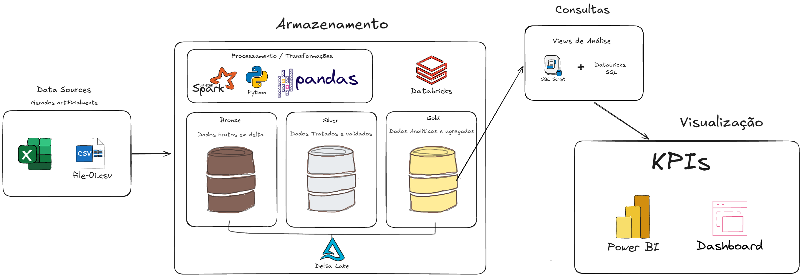
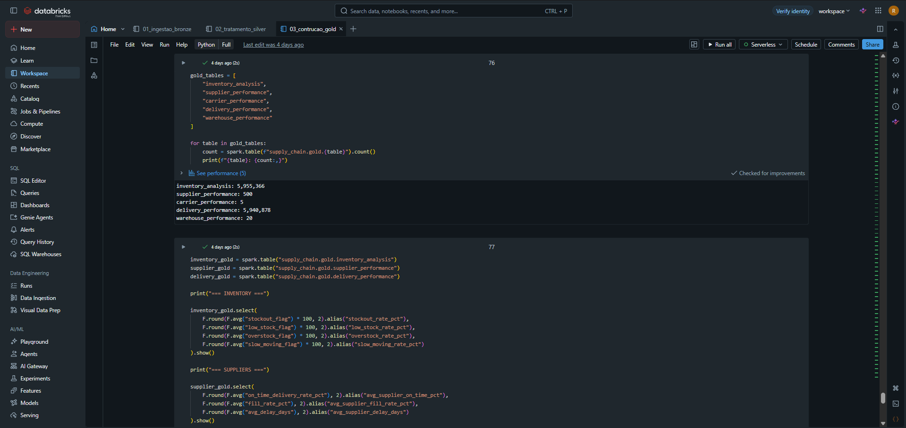
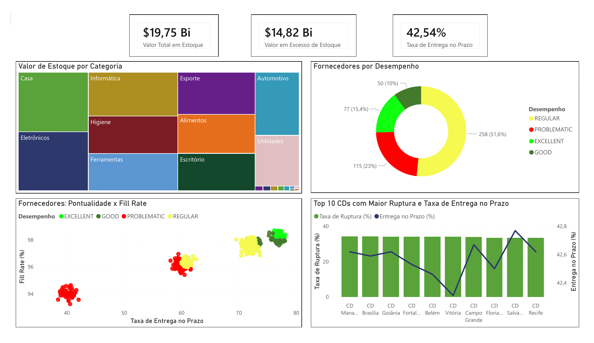
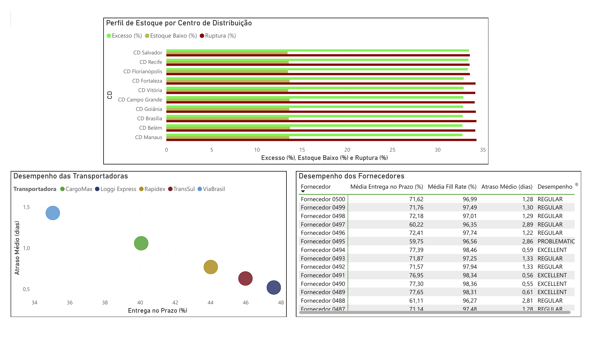

# 📦 Supply Chain Analytics Lakehouse

Projeto de **Engenharia e Análise de Dados** aplicado ao contexto de Logística e Supply Chain, desenvolvido com **Databricks, Apache Spark, PySpark, Delta Lake, SQL e Power BI**.

A solução simula uma operação logística de grande escala com aproximadamente **22 milhões de registros**, percorrendo todo o fluxo desde os arquivos brutos até dashboards e indicadores de negócio.

<p align="left">
  
  &nbsp;&nbsp;
  
  &nbsp;&nbsp;
  
  &nbsp;&nbsp;
  
  
</p>

## 🎯 Visão Geral

<table>
<tr>
<td width="20%" valign="top">

### 🏗️ Engenharia

- Databricks
- Apache Spark
- PySpark
- Delta Lake
- Unity Catalog
- Arquitetura Medallion

</td>
<td width="20%" valign="top">

### 📊 Analytics

- Databricks SQL
- SQL
- Power BI
- DAX
- KPIs
- Modelagem analítica

</td>
<td width="20%" valign="top">

### 📦 Escala

- ~22 milhões de registros
- 7 entidades
- CSV + JSON
- 5 tabelas Gold
- 20 CDs
- 500 fornecedores

</td>

<td width="33%" valign="top">

### ✅ Objetivos

- Processar grandes volumes de dados utilizando Apache Spark;
- Construir uma arquitetura Lakehouse;
- Implementar as camadas Bronze, Silver e Gold;
- Aplicar regras de qualidade e integridade dos dados;
- Criar datasets analíticos orientados ao negócio;
- Construir indicadores de estoque, fornecedores, transportadoras e CDs;
- Disponibilizar os dados através do Databricks SQL;
- Integrar o Lakehouse ao Power BI.
</td>
</tr>
</table>


---

# 🏗️ Arquitetura da Solução

<p align="center">
  
</p>

O projeto utiliza uma arquitetura **Lakehouse no Databricks**, combinando armazenamento flexível, processamento distribuído e tabelas estruturadas para consumo analítico.

```text
Dados Brutos
    │
    ▼
CSV / JSON
    │
    ▼
Databricks + Apache Spark
    │
    ▼
Delta Lake
    │
    ├───────────────┬───────────────┐
    ▼               ▼               ▼
  Bronze          Silver           Gold
    │               │               │
    └───────────────┴───────────────┘
                    │
                    ▼
              Databricks SQL
                    │
                    ▼
                 Power BI
```

---

# 🥉🥈🥇 Arquitetura Medallion

<table>
<tr>
<td width="33%" valign="top">

## 🥉 Bronze

**Objetivo:** preservar os dados próximos da origem.

- Ingestão com PySpark;
- Persistência em Delta;
- Sem aplicação das principais regras de negócio;
- Manutenção do volume original;
- Base para as próximas camadas.

**Entidades:**

`products`  
`suppliers`  
`warehouses`  
`purchase_orders`  
`inventory_snapshots`  
`orders`  
`shipments`

</td>

<td width="33%" valign="top">

## 🥈 Silver

**Objetivo:** gerar dados confiáveis e padronizados.

Principais tratamentos:

- Deduplicação;
- Tratamento de nulos;
- Padronização de textos;
- `trim`;
- Padronização de status;
- Validação de datas;
- Validação de preços;
- Validação de quantidades;
- Integridade referencial;
- Remoção de FKs inválidas;
- Recálculo de campos;
- Regras de qualidade.

</td>

<td width="33%" valign="top">

## 🥇 Gold

**Objetivo:** disponibilizar dados prontos para Analytics e BI.

Tabelas criadas:

`inventory_analysis`

`supplier_performance`

`delivery_performance`

`carrier_performance`

`warehouse_performance`

Utilizadas para:

- KPIs;
- Databricks SQL;
- Análises de negócio;
- Dashboards;
- Power BI.

</td>
</tr>
</table>


<p align="left">
  <b>Volume bruto total: aproximadamente 22 milhões de registros</b>
</p>


---

# 🥇 Camada Gold

A camada Gold transforma os dados operacionais em datasets preparados para consumo analítico.

| Tabela Gold | Granularidade | Finalidade |
|---|---|---|
| `inventory_analysis` | Registro de estoque | Estoque, valor, ruptura, excesso e slow moving |
| `supplier_performance` | Fornecedor | Pontualidade, Fill Rate e atraso |
| `delivery_performance` | Entrega | Performance logística por shipment |
| `carrier_performance` | Transportadora | Comparação de transportadoras |
| `warehouse_performance` | Centro de Distribuição | Performance operacional dos CDs |


---

# 🔎 Databricks SQL

Após a construção da camada Gold, as tabelas foram utilizadas no **Databricks SQL** para exploração e validação dos indicadores.

O dashboard permite analisar:

<table>
<tr>
<td width="50%" valign="top">

- Taxa de Ruptura;
- Estoque Baixo;
- Excesso de Estoque;
- Entrega no Prazo;

</td>
<td width="50%" valign="top">

- Performance dos fornecedores;
- Performance das transportadoras;
- Ruptura por CD;
- Classificação dos fornecedores.

</td>
</tr>
</table>


<p align="center">
  
  
</p>


---

# 📊 Power BI

A camada final de visualização foi desenvolvida no **Power BI**, conectado às tabelas Gold do Databricks.

Foi utilizado um modelo misto:

| Modo | Aplicação |
|---|---|
| **Import** | Tabelas Gold menores e agregadas |
| **DirectQuery** | Tabelas detalhadas com milhões de registros |

---

## 📊 Visão Executiva

<p align="center">
  
</p>

<table>
<tr>
<td width="50%" valign="top">


</td>
</tr>
</table>

---

## 🔎 Análise Operacional

<p align="center">
  
</p>

<table>
<tr>
<td width="50%" valign="top">

</td>
</tr>
</table>

---

# 🛠️ Stack Tecnológica

<table>
<tr>
<td width="25%" valign="top">

### Processamento

- Apache Spark
- PySpark
- Databricks

</td>
<td width="25%" valign="top">

### Armazenamento

- Delta Lake
- Unity Catalog
- Lakehouse

</td>
<td width="25%" valign="top">

### Analytics

- SQL
- Databricks SQL
- DAX

</td>
<td width="25%" valign="top">

### Visualização

- Power BI
- Databricks Dashboard

</td>
</tr>
</table>

---

# 🧠 Conceitos Aplicados

<table>
<tr>
<td width="33%" valign="top">

### Arquitetura

- Data Lakehouse
- Data Lake
- Medallion Architecture
- Bronze / Silver / Gold
- Delta Tables

</td>
<td width="33%" valign="top">

### Engenharia

- ETL / ELT
- Data Quality
- Processamento distribuído
- Deduplicação
- Integridade referencial
- Foreign Keys
- Joins

</td>
<td width="33%" valign="top">

### Analytics

- KPIs
- Agregações
- Modelagem analítica
- DirectQuery
- Import Mode
- Business Intelligence

</td>
</tr>
</table>

---

# 📂 Estrutura do Repositório

```text
Supply-Chain-Analytics/
│
├── imagens/
│   ├── Arquitetura.png
│   ├── dashboard-databricks.png
│   ├── pag1.png
│   ├── pag2.png
|   └── note.png
│
├── notebooks/
│   ├── 01_ingestao_bronze
│   ├── 02_tratamento_silver
│   └── 03_construcao_gold
│
├── dashboard/
│
└── README.md
```

---

# 📚 Principais Aprendizados

<table>
<tr>
<td width="50%" valign="top">

### Engenharia de Dados

- Processamento de milhões de registros;
- PySpark e Apache Spark;
- Tabelas Delta;
- Arquitetura Medallion;
- Tratamento de inconsistências;
- Validação de Foreign Keys;
- Joins e integridade referencial.

</td>
<td width="50%" valign="top">

### Analytics & BI

- Criação de tabelas Gold;
- Desenvolvimento de KPIs;
- Databricks SQL;
- Integração Databricks + Power BI;
- DirectQuery;
- Import Mode;
- Dashboards executivos e operacionais.

</td>
</tr>
</table>

---

